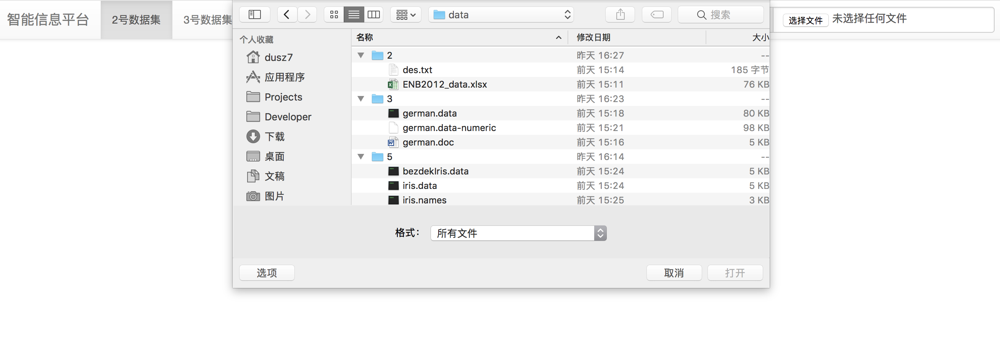
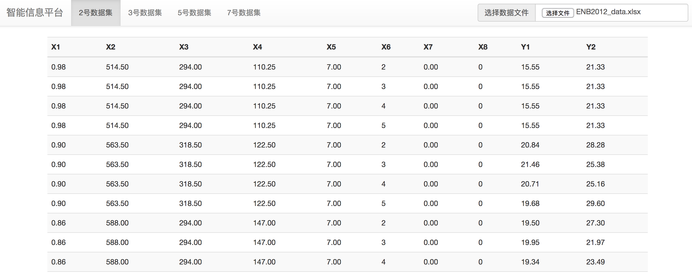
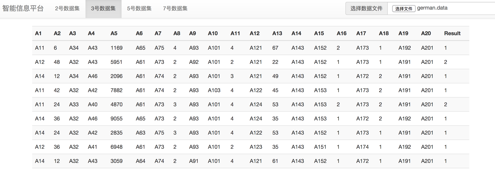
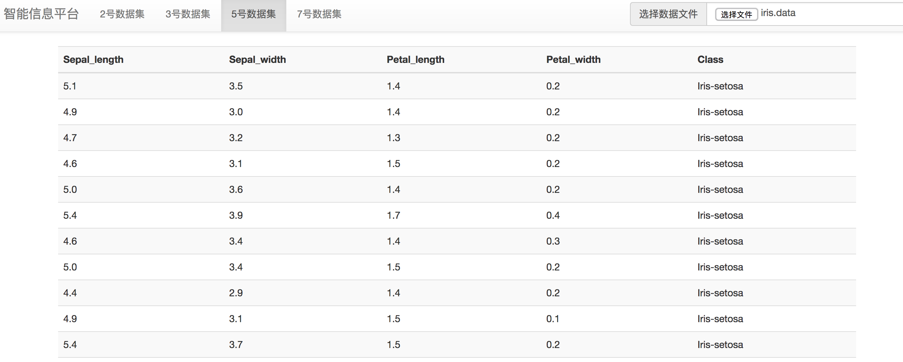
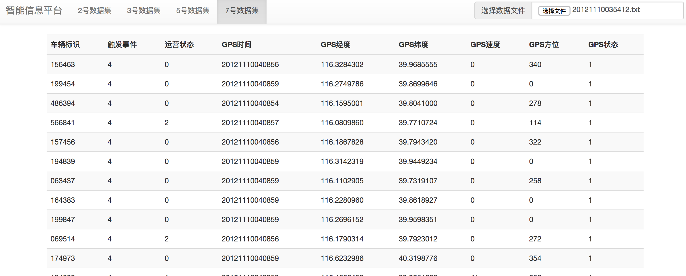

##“智能信息平台”程序说明
本程序为Web前端程序，主要是用JS写成。

运行说明：

* 使用浏览器（建议Chrome）打开“index.html”即可

程序功能包括：

* 分多页分别展示不同数据集
* 数据集文件上传
* 数据集文件解析
* 数据集文件信息读取和处理
* 数据集文件以表格形式展出

数据集选择及格式说明：

* 数据集2:Energy+efficiency（xlsx格式表格）
* 数据集3:German Credit Data（data格式文本）
* 数据集5:Iris（data格式文本）
* 数据集7:出租车GPS数据（txt格式文本）

程序运行截图：

程序初始界面（未选择文件），上方为导航栏，可以跳转不同数据集处理页，导航栏右侧为“数据集文件选择框”，用于选择数据集文件。

点击“选择文件”按钮后弹出文件选择框，可以选择数据集文件。

数据集2读出展示。

数据集3读出展示。

数据集5读出展示。

数据集7读出展示。