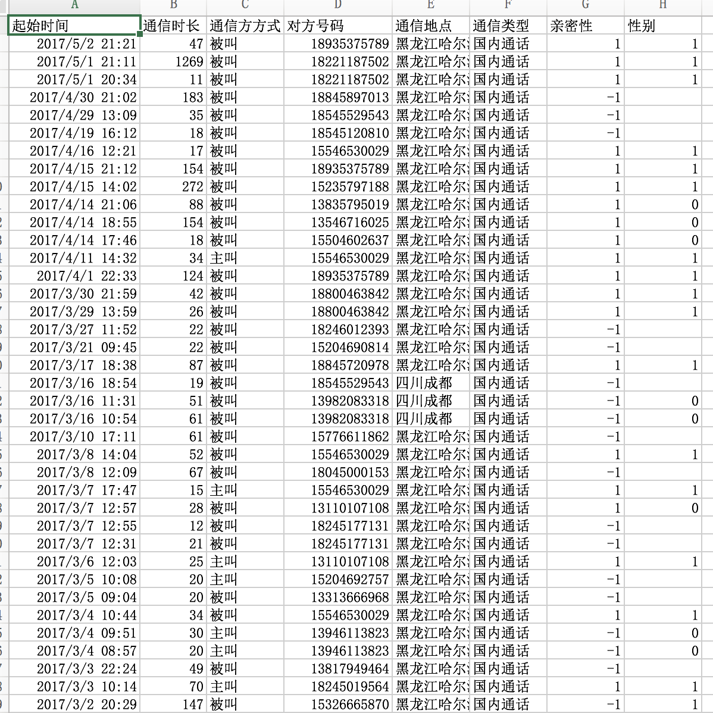
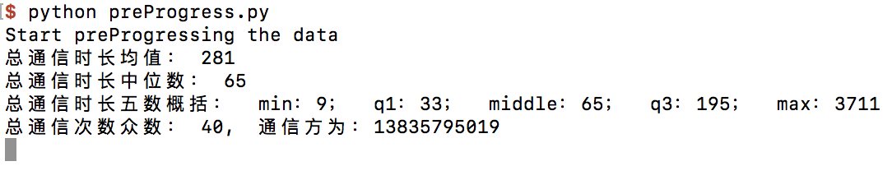
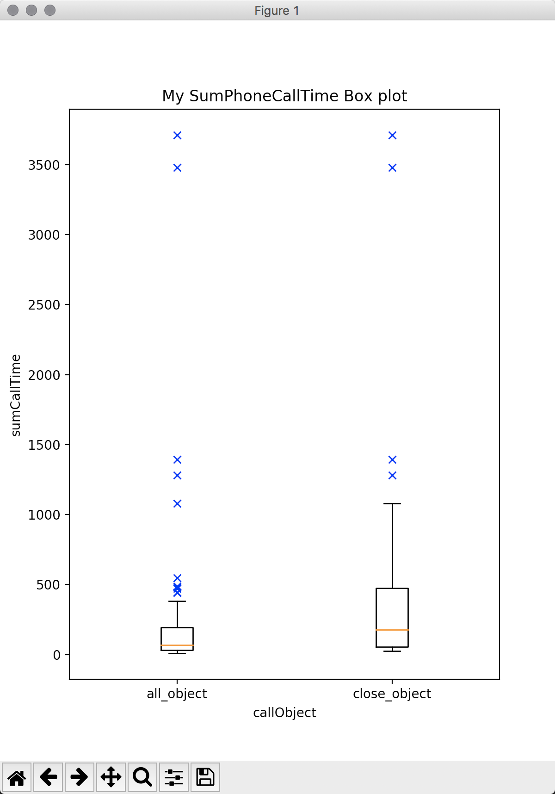

#作业2-1 报告

##本次作业分为两部分：

1. 处理源数据

	* 手动删除多余属性列

	
	* 统一属性名（如将“通话时长”修改为“通信时长”等）
	* 利用Python脚本“countTime.py”将通信时长单位统一为秒
	* 手动标记添加“亲密性”属性。“1”代表“亲密”，“-1”代表“不亲密”
	* 手动标记添加“性别”属性。“1”代表“男性”，“0”代表“女性”，“2”代表“不详”

2. 计算统计值和绘制盒图

	* 编写处理数据的Python脚本

	
	* 读取csv文件并有效获取数据
	* 计算每个通信方的通信总时长
	* 计算“通信总时长”这组数据的平均数、中位数、五数概括以及通信次数的众数等统计值
	* 针对“通信总时长”数据绘制盒图

##运行说明：

* 所需Python库：matplotlib

* 将数据文件放到该项目根目录内，命名为“myCallsData.csv”
* 运行Python脚本“preProgress.py”脚本即可

##程序功能介绍：

###函数说明

* csv2dict：将csv文件内数据读取到Python字典中，第一个参数为字典中的key（本程序中以对方手机号码为key），第二个参数为想要获取的属性或结合本程序逻辑的分析种类

* getAverage：获得平均值，参数为待求数组
* getPercentageValue：获得百分位数（用于计算四分位数，中位数等），第一个参数为待求数组，第二个参数为百分位

###逻辑说明

1. 获取‘对方号码’-‘通信时长’的字典，对字典进行排序，并将通信时长赋值给一个数组

2. 对有序的通信时长数组进行计算，得到平均数、中位数、四分位数等统计值
3. 获取‘对方号码’-‘通信次数’的字典，对字典进行降序排序，获得最大的通信次数，即通信次数众数
4. 获取标记为“亲密关系”的人的通信时长数据相关的字典，进行相似处理
5. 对“通信总时长”和“亲密人通信总时长”两组数据绘制盒图

##作业成果展示截图：

对数据源进行处理后部分数据截图

程序运行后，统计值输出

盒图展示：左边为全部通信人，右边为标记为亲密关系的联系人