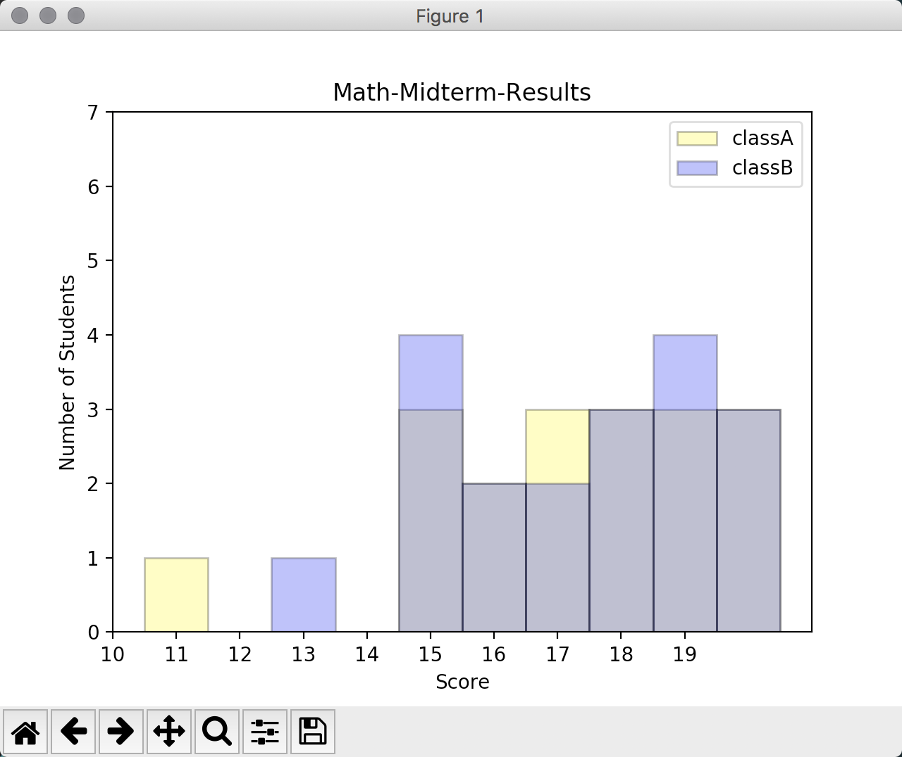
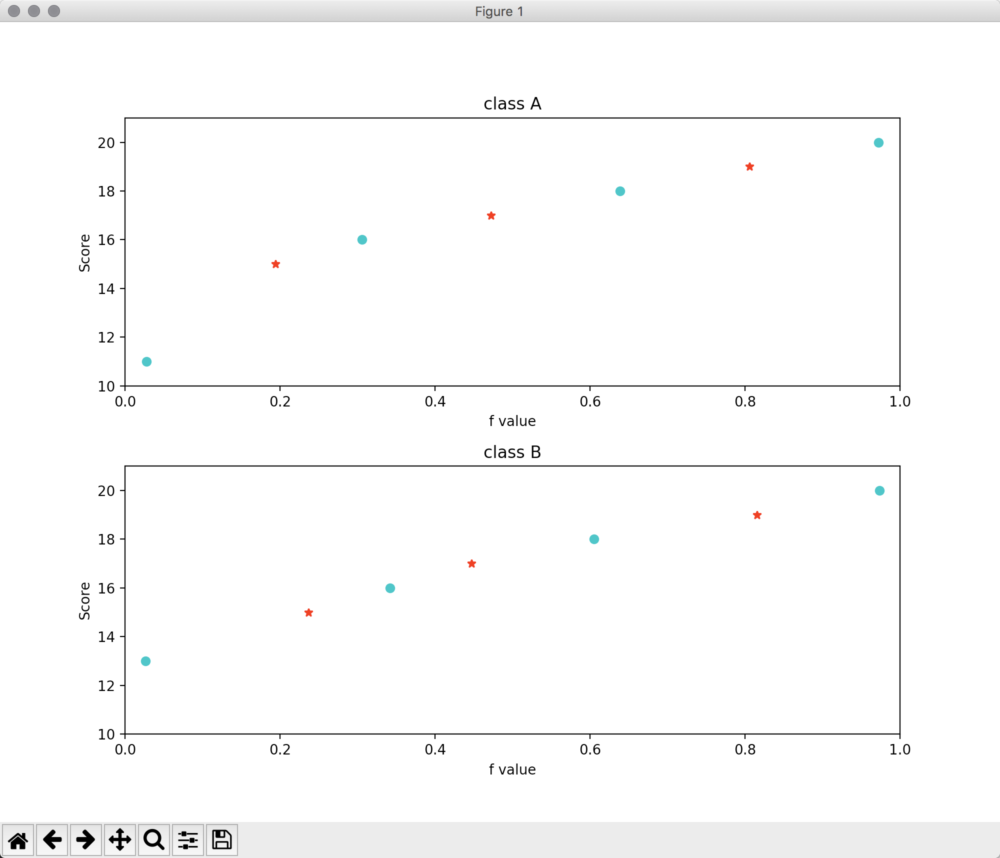

#作业2-2 报告

##本次作业分为两部分：

1. 绘制两班成绩的直方图

	* "histo.py"脚本

2. 绘制两班成绩的分位数图

	* "qq.py"脚本

##程序说明：

###绘制直方图

1. 将两班的工数成绩填入两个数组内

2. 对数据做处理

	对成绩数据进行排序
	
		classAResults.sort()
		classBResults.sort()
    
    分别求得两个班中每个成绩出现的频数，存入字典内
    	
    	# 获得每个成绩出现的频数
		classAResultsCount = {}
		classBResultsCount = {}
		for ra in classAResults:
    		classAResultsCount[ra] = classAResultsCount.get(ra,0)+1
		for rb in classBResults:
    		classBResultsCount[rb] = classBResultsCount.get(rb,0)+1
3. 绘制直方图

	设置图例坐标、尺度等属性
	
		maxPeople = 7
		bins = np.arange(0,20)
		plt.xticks(bins)
		plt.xlim(minResult-1,maxResult+1)
		plt.ylim(0,maxPeople)
	
	为每个成绩绘制一个矩形，其宽度为一个单位长度，高为该成绩出现的次数。
	
	将两组成绩的频数分布绘制在一个图中，用不同颜色表示：黄色为A班，蓝色为B班。
	
		for rac in classAResultsCount.keys():
    	rap = plt.axvspan(rac - 0.5, rac + 0.5, ymin = 0, ymax = 1.0*classAResultsCount[rac]/maxPeople, fc = 'yellow', ec = 'black', alpha = 0.3, label='classA')

		for rbc in classBResultsCount.keys():
    		rbp = plt.axvspan(rbc - 0.5, rbc + 0.5, ymin = 0, ymax = 1.0*classBResultsCount[rbc]/maxPeople, fc = 'blue', ec = 'black', alpha = 0.3, label='classB')
	
	设置图题，图例等属性
	
		plt.legend(handles=[rap,rbp], loc = 'upper right')
		plt.title('Math-Midterm-Results')
		plt.xlabel('Score')
		plt.ylabel('Number of Students')

###绘制分位数图

1. 将两班的工数成绩填入两个数组内

2. 对数据做处理

	对成绩数据进行排序
	
		classAResults.sort()
		classBResults.sort()
    
    分别求得两个班中每个成绩出现的频数，存入字典内
    	
    	# 获得每个成绩出现的频数
		classAResultsCount = {}
		classBResultsCount = {}
		for ra in classAResults:
    		classAResultsCount[ra] = classAResultsCount.get(ra,0)+1
		for rb in classBResults:
    		classBResultsCount[rb] = classBResultsCount.get(rb,0)+1
    		
    计算每个成绩对应的fi
    
    	classAResultsQuartile = {}
		classBResultsQuartile = {}
		temp = 0;
		for rac in classAResultsCount.keys():
    		theCount = classAResultsCount.get(rac)
    		temp = temp + theCount
    		classAResultsQuartile[rac] = (temp-0.5)/len(classAResults)
		temp = 0
		for rbc in classBResultsCount.keys():
    		theCount = classBResultsCount.get(rbc)
    		temp = temp + theCount
    		classBResultsQuartile[rbc] = (temp-0.5)/len(classBResults)
    		
    求得分位数点
    
    	classAQ1 = getPercentageValue(classAResults,0.25)
		classAMiddle = getPercentageValue(classAResults,0.5)
		classAQ3 = getPercentageValue(classAResults,0.75)

		classBQ1 = getPercentageValue(classBResults,0.25)
		classBMiddle = getPercentageValue(classBResults,0.5)
		classBQ3 = getPercentageValue(classBResults,0.75)
3. 绘制分位数图
	
	设置图标大小，将图分为两个，分别绘制A班和B班的分位数图
	
		plt.figure(figsize=(10,8))
		classaFig = plt.subplot(211)
		classaFig.set_xlim([0, 1])
		classaFig.set_ylim([minResult-1, maxResult+1])
		classbFig = plt.subplot(212)
		classbFig.set_xlim([0, 1])
		classbFig.set_ylim([minResult-1, maxResult+1])
	
	绘制A班的分位数图
		
		plt.sca(classaFig)
		plt.title('class A')
		plt.xlabel('f value')
		plt.ylabel('Score')
		plt.subplots_adjust(hspace = 0.3)
		for x in classAResultsQuartile.keys():
    		if x == classAQ1:
        		classaFig.plot(classAResultsQuartile[x], x, 'r*')
    		elif x == classAMiddle:
        		classaFig.plot(classAResultsQuartile[x], x, 'r*')
    		elif x == classAQ3:
        		classaFig.plot(classAResultsQuartile[x], x, 'r*')
    		else:
        		classaFig.plot(classAResultsQuartile[x], x, 'co')
        		
	绘制B班的分位数图
	
		plt.sca(classbFig)
		plt.title('class B')
		plt.xlabel('f value')
		plt.ylabel('Score')
		for x in classBResultsQuartile.keys():
    		if x == classBQ1:
        		classbFig.plot(classBResultsQuartile[x], x, 'r*')
    		elif x == classBMiddle:
        		classbFig.plot(classBResultsQuartile[x], x, 'r*')
    		elif x == classBQ3:
        		classbFig.plot(classBResultsQuartile[x], x, 'r*')
    		else:
        		classbFig.plot(classBResultsQuartile[x], x, 'co')

##作业成果展示截图：

直方图绘制结果

分位数图绘制结果