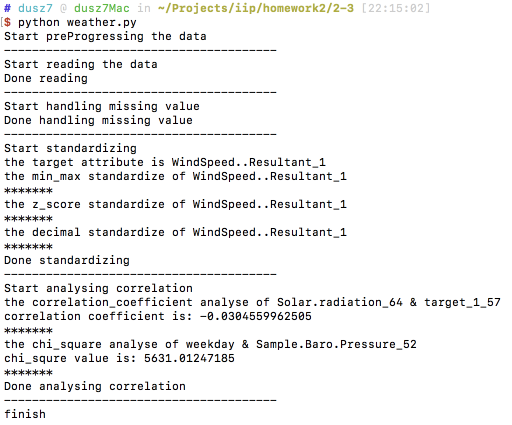
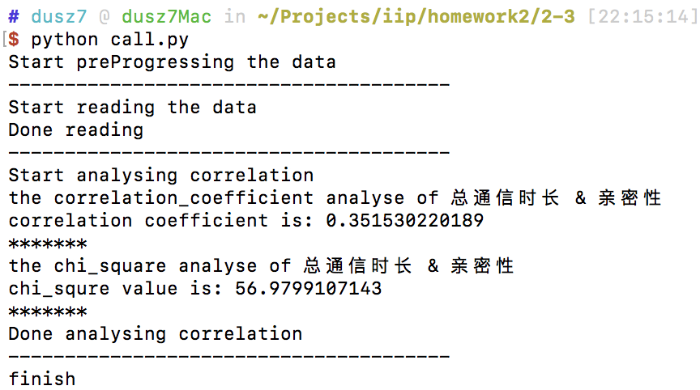

#作业2-3 报告

##本次作业分为两部分：

1. “空气质量”数据集操作

	* 采用均值填充方式进行缺失处理
	
	* 对“WindSpeed..Resultant_1”属性进行三种方法的规范化
	* 使用相关系数对“Solar.radiation_64”和“target_1_57”属性的相关分析
	* 使用卡方检验分析“weekday”和“Sample.Baro.Pressure_52”属性的相关性

2. 通信记录数据集操作

	* 使用相关系数对“总通信时长”和“亲密性”进行相关分析
	
	* 使用卡方检验“总通信时长”和“亲密性”属性的相关性 

##程序说明：

###“空气质量”数据集

####程序流程

1. 从本地表格文件读取“空气质量”数据集

2. 提取本次任务相关属性，重新构建有效数据集
3. 对有效数据集中的缺失值进行处理，本次任务中使用“均值填充”的方法对相关属性的缺失值进行处理
4. 对本次任务选定的“WindSpeed..Resultant_1”属性的数值进行规范化，分别利用最大最小值、z_score、小数定标方法进行规范化
5. 对“Solar.radiation_64”和“target_1_57”属性进行相关性分析，分别使用相关系数和卡方分析方法

####函数分析

读取数据并构建有效数据集
	
	with open(in_file, 'rb') as fin:
        reader = csv.reader(fin, delimiter=',')
        fieldnames = next(reader)
        reader = csv.DictReader(fin, fieldnames=fieldnames, delimiter=',')
        tempDict = {}
        for row in reader:
            tempDict = {}
            for attri in saved_attribute:
                tempDict[attri] = row[attri]
            weatherData.append(tempDict)

首先定义了本次任务中会用到的属性列表saved_attribute，在本地的csv文件读取数据，并将需要的属性填充到一个临时的字典中，再将该字典一条一条添加进本次程序用到的列表weatherData中

处理缺失值

	for element in weatherData:
        if element['Solar.radiation_64'] != 'NA':
            solarSum += float(element['Solar.radiation_64'])
            solarCount += 1
        if element['target_1_57'] != 'NA':
            targetSum += float(element['target_1_57'])
            targetCount += 1
        if element['Sample.Baro.Pressure_52'] != 'NA':
            pressureSum += float(element['Sample.Baro.Pressure_52'])
            pressureCount += 1
        if element['WindSpeed..Resultant_1'] != 'NA':
            windSpeedSum += float(element['WindSpeed..Resultant_1'])
            windSpeedCount += 1

    for element in weatherData:
        if element['Solar.radiation_64'] == 'NA':
            element['Solar.radiation_64'] = solarSum/solarCount
        if element['target_1_57'] == 'NA':
            element['target_1_57'] = targetSum/targetCount
        if element['Sample.Baro.Pressure_52'] == 'NA':
            element['Sample.Baro.Pressure_52'] = pressureSum/pressureCount
        if element['WindSpeed..Resultant_1'] == 'NA':
            element['WindSpeed..Resultant_1'] = windSpeedSum/windSpeedCount
            
采用“均值填充”的方法对处理需要用到的属性进行缺失值处理，先计算出均值，再逐一对缺失值赋值均值

最大最小规范化

	def _standardized_min_max(data, attri, new_min, new_max):
    print ('the min_max standardize of '+str(attri))
    old_min = float(data[0][attri])
    old_max = old_min

    for element in data:
        if float(element[attri]) < old_min:
            old_min = float(element[attri])
        if float(element[attri]) > old_max:
            old_max = float(element[attri])

    old_sclar = old_max - old_min
    new_sclar = new_max - new_min
    for element in data:
        element[attri] = (float(element[attri]) - old_min)/old_sclar*new_sclar + new_min

z_score规范化

	def _standardized_z_score(data, attri):
    print ('the z_score standardize of '+str(attri))
    theSum = 0.0
    count = 0
    mean = 0.0
    for element in data:
        theSum += float(element[attri])
        count += 1
    mean = theSum/count

    theDevSum = 0.0
    stand_dev = 0.0
    for element in data:
        theDevSum += pow((float(element[attri])-mean),2)
    stand_dev = (theDevSum/count) ** 0.5
    # print stand_dev
    for element in data:
        element[attri] = (float(element[attri])-mean)/stand_dev
      
小数定标规范化

	def _standardized_decimal(data, attri):
    print ('the decimal standardize of '+str(attri))
    theMax = abs(float(data[0][attri]))
    theJ = 0
    for element in data:
        if abs(float(element[attri])) > theMax:
            theMax = abs(float(element[attri]))
    while theMax > 1:
        theMax = theMax/10
        theJ += 1
    # print theJ
    for element in data:
        element[attri] = float(element[attri])/pow(10,theJ)
        
相关系数分析

	def _analyse_correlation_coefficient(data, attri_1, attri_2):
    print ('the correlation_coefficient analyse of '+str(attri_1)+" & "+str(attri_2))
    sum_1 = 0.0
    sum_2 = 0.0
    mean_1 = 0.0
    mean_2 = 0.0
    count = 0
    acc = 0.0
    for element in data:
        sum_1 += float(element[attri_1])
        sum_2 += float(element[attri_2])
        count += 1
        acc += float(element[attri_1])*float(element[attri_2])
    mean_1 = sum_1/count
    mean_2 = sum_2/count

    dev_sum_1 = 0.0
    dev_sum_2 = 0.0
    stand_dev_1 = 0.0
    stand_dev_2 = 0.0
    for element in data:
        dev_sum_1 += pow((float(element[attri_1])-mean_1),2)
        dev_sum_2 += pow((float(element[attri_2])-mean_2),2)
    stand_dev_1 = (dev_sum_1/count) ** 0.5
    stand_dev_2 = (dev_sum_2/count) ** 0.5

    coe = (acc - count * mean_1 * mean_2)/((count-1)*stand_dev_1*stand_dev_2)
    print "correlation coefficient is: "+str(coe)
    
卡方分析

	def _analyse_chi_square(data, attri_1, attri_2):
    print ('the chi_square analyse of '+str(attri_1)+" & "+str(attri_2))
    cate_sum_1 = {}
    cate_sum_2 = {}
    sample_real = {}
    count = 0
    for element in data:
        cate_sum_1[element[attri_1]] = cate_sum_1.get(element[attri_1],0) + 1
        cate_sum_2[element[attri_2]] = cate_sum_2.get(element[attri_2],0) + 1
        sample_real[str(element[attri_1])+'&'+str(element[attri_2])] = sample_real.get(str(element[attri_1])+'&'+str(element[attri_2]),0) + 1
        count += 1

    sample_predict = {}
    chi_square = 0.0
    for cate1 in cate_sum_1.keys():
        for cate2 in cate_sum_2.keys():
            sample_predict[str(cate1)+'&'+str(cate2)] = float(cate_sum_1.get(cate1)*cate_sum_2.get(cate2))/count
            sample_real[str(cate1)+'&'+str(cate2)] = sample_real.get(str(cate1)+'&'+str(cate2),0)
            chi_square += pow(sample_real[str(cate1)+'&'+str(cate2)]-sample_predict[str(cate1)+'&'+str(cate2)],2)/sample_predict[str(cate1)+'&'+str(cate2)]

####程序运行截图

其中，在使用“均值填充”对数据进行缺失值处理后，两个属性的相关系数为-0.0304559，卡方分析计算结果为5631.01247

###通信记录数据集

####程序流程

1. 读取本地的通信记录数据集

2. 计算出“总通信时长”，并构建“对方号码”、“总通信时长”、“亲密性”属性的新数据集
3. 对“总通信时长”和“亲密关系”属性做相关系数计算和卡方检验

####函数说明

读取表格文件，计算总通信时长

	def csv2dict(in_file, key, value):
    new_dict = {}
    with open(in_file, 'rb') as fin:
        reader = csv.reader(fin, delimiter=',')
        fieldnames = next(reader)
        reader = csv.DictReader(fin, fieldnames=fieldnames, delimiter=',')
        tempDict = {}
        for row in reader:
            if(value == '通信时长'):
                new_dict[row[key]] = new_dict.get(row[key],0) + int(row[value])
            elif(value == '亲密分析'):
                new_dict[row[key]] = int(row['亲密性'])
            else:
                new_dict[row[key]] = row[value]
    return new_dict
    
读取表格文件中的数据，并计算出总通信时长，根据对方号码为key，分表构建关于通信时长和亲密性两个字典

构建新数据集

	for pnum in sumCallTimeDict.keys():
        temp_dict = {}
        temp_dict['对方号码'] = pnum
        temp_dict['总通信时长'] = str(sumCallTimeDict[pnum])
        temp_dict['亲密性'] = str(sumCloseCallTimeDict[pnum])
        callData.append(temp_dict)

为了使用前一程序中的函数，构建类似的只含有相关属性的数据集

相关系数计算和卡方检验的方法与前一程序中相同

####程序运行截图

相关系数为0.351530

卡方检验结果为56.97991