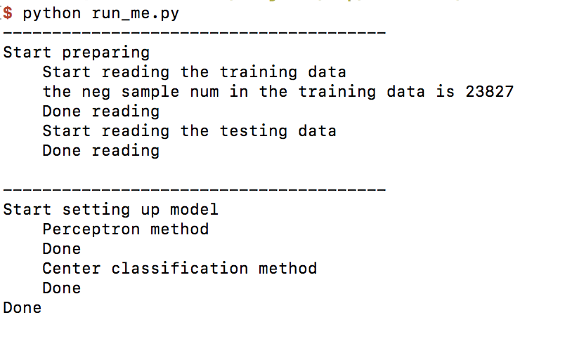
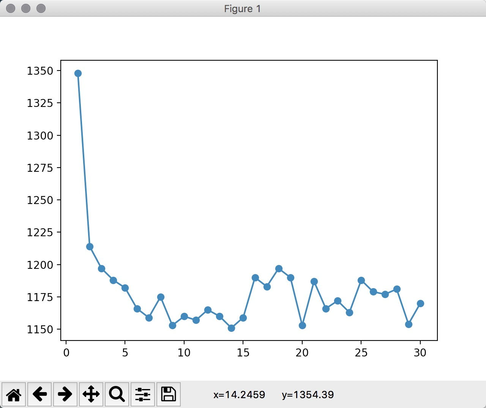
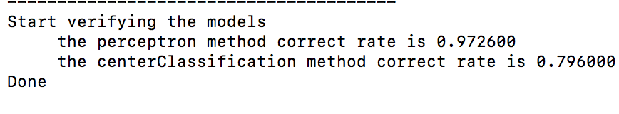
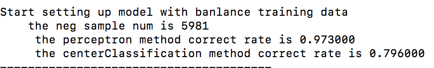
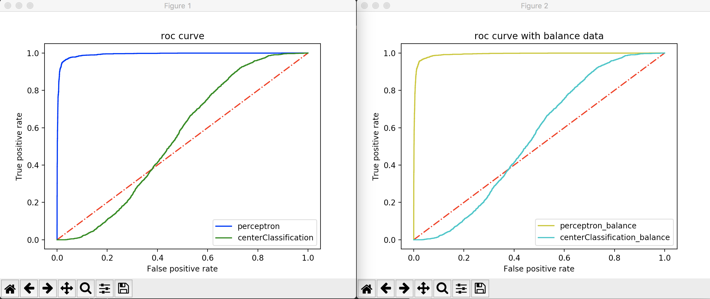

#作业3-1 报告

##作业内容：

1. 实现“感知机”算法

2. 实现“最近中心分类器”
	
3. “数据集不平衡”问题

##程序说明：

###总体流程

1. 读取“训练集”数据和“测试集”数据，以矩阵形式存储

2. 利用“训练集”数据分别训练出“感知机”算法模型和“最近中心分类器”模型
3. 利用训练出的模型对“测试集”数据进行验证，统计正确率
4. 采用“随机取样”的方法，重新取得“训练集”（使得新的训练集中正例样本数和负例样本数大致相同）
5. 对新的训练集采取同样的过程训练出新的模型
6. 分别绘制以上得到的模型的ROC曲线，比较模型的性能

###“感知机”算法

####函数分析

初始化：
	
	def __init__(self, eta = 0.1, iteration_num = 20):
        self.eta = eta
        self.iteration_num = iteration_num

定义本次训练的学习率和迭代次数。

计算预测值方法：
	
	def net_in_method(self,xi):
        return np.dot(xi, self.wights[1:]) + 1 * self.wights[0]

    def predict(self, xi):
        return np.where(self.net_in_method(xi) >= 0.0, 1, -1)

迭代过程：

	def iteration(self, X, y):
        #wights[0]为bias，随机权值从零开始
        self.wights = np.zeros(1 + X.shape[1])
        self.error_sample_num = []

        for time in range(self.iteration_num):
            errors = 0
            #将X向量、预测值和对应的真实结果进行比较、运算
            for xi, true_y in zip(X, y):
                is_corrent = true_y - self.predict(xi)
                if is_corrent != 0.0:
                    self.wights[1:] += self.eta * true_y * xi
                    self.wights[0] += self.eta * true_y * 1
                errors += int(is_corrent != 0.0)
            self.error_sample_num.append(errors)
        return self
            
采用“随机剃度下降”的方法，初始权值及偏置设为0。采用“感知机学习算法”，每次迭代中，依次通过每个样本对权值和偏置进行调整，一共迭代规定次数。统计迭代过程中错误预测数可以用来判断是否收敛。

对测试数据进行验证：

	def verify(self,X,y):
        errors = 0
        for xi, true_y in zip(X,y):
            is_corrent = true_y - self.predict(xi)
            errors += int(is_corrent != 0.0)
        return errors
 
遍历一遍所有的测试数据，统计预测错误的样本数。

获得ROC曲线上的点集：

	def roc(self,X,y):
        buf = array("d")
        pos_true_num = 0
        neg_true_num = 0
        for xi, true_y in zip(X,y):
            buf.append(true_y)
            buf.append(self.net_in_method(xi))
            if true_y > 0:
                pos_true_num += 1
            else:
                neg_true_num += 1
        rocs = np.frombuffer(buf, dtype=[('t',float),('y',float)])
        rocs = np.sort(rocs, order = 'y')
        roc_x = []
        roc_y = []
        roc_x.append(1)
        roc_y.append(1)
        index_now = 0
        pos_true_num_now = 0
        for roc in rocs:
            index_now += 1
            if roc['t'] > 0:
                pos_true_num_now += 1

            pos_predict_neg_true_num = neg_true_num - (index_now - pos_true_num_now)
            pos_predict_pos_true_num = pos_true_num - pos_true_num_now
            roc_x.append(float(pos_predict_neg_true_num)/neg_true_num)
            roc_y.append(float(pos_predict_pos_true_num)/pos_true_num)

        roc_x.append(0)
        roc_y.append(0)

        return [roc_x,roc_y]

在“感知机”算法中，直接将“计算预测值的函数结果”（权值与各纬度特征值的加和值）作为绘制ROC曲线过程中变化的阈值，以此将“预测为正例”的概率映射到0-1之间。

###“最近中心分类器”算法

####函数分析

计算预测值的函数：

	def net_in_method(self,xi):
        neg_class_distance = np.var(np.row_stack((self.neg_class_center,xi)))
        pos_class_distance = np.var(np.row_stack((self.pos_class_center,xi)))
        return (neg_class_distance - pos_class_distance)

    def predict(self,xi):
        if self.net_in_method(xi) > 0:
            return 1
        else:
            return -1

通过计算测试点到每个类中心的距离，取最小距离的类为当前测试点的分类。

计算每个类别的中心：

	def classify(self,X,y):
        neg_sample_buf = array('d')
        pos_sample_buf = array('d')
        for xi,true_y in zip(X,y):
            if true_y < 0:
                for fea in xi:
                    neg_sample_buf.append(fea)
            else:
                for fea in xi:
                    pos_sample_buf.append(fea)
        neg_sample_X = np.frombuffer(neg_sample_buf, dtype=np.float).reshape(-1, 22)
        pos_sample_X = np.frombuffer(pos_sample_buf, dtype=np.float).reshape(-1, 22)
        self.neg_class_center = np.mean(neg_sample_X, axis = 0)
        self.pos_class_center = np.mean(pos_sample_X, axis = 0)
            
通过计算“训练集”中每个类中所有样本各个维度特征的平均值最为该类的中心

对测试数据进行验证：

	def verify(self,X,y):
        errors = 0
        for xi,true_y in zip(X,y):
            predict_y = self.predict(xi)
            errors += int(true_y != predict_y)
        return errors
 
遍历一遍所有的测试数据，统计预测错误的样本数。

获得ROC曲线上的点集：

	def roc(self,X,y):
        buf = array("d")
        pos_true_num = 0
        neg_true_num = 0
        for xi, true_y in zip(X,y):
            buf.append(true_y)
            #将（到负类中心的距离减去到正类中心的距离）作为阈值
            buf.append(self.net_in_method(xi))
            if true_y > 0:
                pos_true_num += 1
            else:
                neg_true_num += 1
        rocs = np.frombuffer(buf, dtype=[('t',float),('y',float)])
        rocs = np.sort(rocs, order = 'y')
        roc_x = []
        roc_y = []
        roc_x.append(1)
        roc_y.append(1)
        index_now = 0
        pos_true_num_now = 0
        for roc in rocs:
            index_now += 1
            if roc['t'] > 0:
                pos_true_num_now += 1

            pos_predict_neg_true_num = neg_true_num - (index_now - pos_true_num_now)
            pos_predict_pos_true_num = pos_true_num - pos_true_num_now
            roc_x.append(float(pos_predict_neg_true_num)/neg_true_num)
            roc_y.append(float(pos_predict_pos_true_num)/pos_true_num)

        roc_x.append(0)
        roc_y.append(0)

        return [roc_x,roc_y]]

在“最近中心分类器”算法中，将“到负类中心距离减去到正类中心距离”作为绘制ROC曲线过程中变化的阈值，即测试点离负类中心比到正类中心越远，越有可能是正类。以此将“预测为正例”的概率映射到0-1之间。

###解决数据不平衡

####随机取样

	with open(training_data_file, 'rb') as fin:
        reader = csv.reader(fin, delimiter=',')
        buf = array("d")
        negs = 0;
        chosen = 0;
        for row in reader:
            if row[22] == '-1':
                negs += 1
                if random.randint(1,4) != 2:
                    continue
                chosen += 1
            for e in row:
                buf.append(float(e))
        na = np.frombuffer(buf, dtype=np.float).reshape(-1, 23)
        new_X = na[:,0:22]
        new_y = na[:,22]
        new_y = new_y.astype(int)
      
因为“训练集”中负例样本数大致是正例样本数的4倍，因此重新取用于训练的“训练集”样本，随机只选取占总负例样本数1/4的负例样本。

##结果分析

读取数据集、建立学习模型。

（遇到问题：在本次作业中，建立“感知机”模型时通过调整学习率对下降过程没有影响，权值只会随着学习率的变化而整体呈现相同倍数的变化。且在迭代2次后，已经出现震荡，如下图）

模型正确率：

在调整了训练模型用的“训练数据”后，新的模型正确率：

发现中心分类器基本没有变化，分析算法应该没错，难道是数据集中心特征很相似？
“感知机”算法正确率变化也不大。

绘制出的ROC曲线：

可以明显看到“感知机”算法建立的模型比“中心分类器”的性能要强很多，但是在调整“训练集”数据后对性能基本没有影响，怀疑是“不平衡”处理的方法不好。